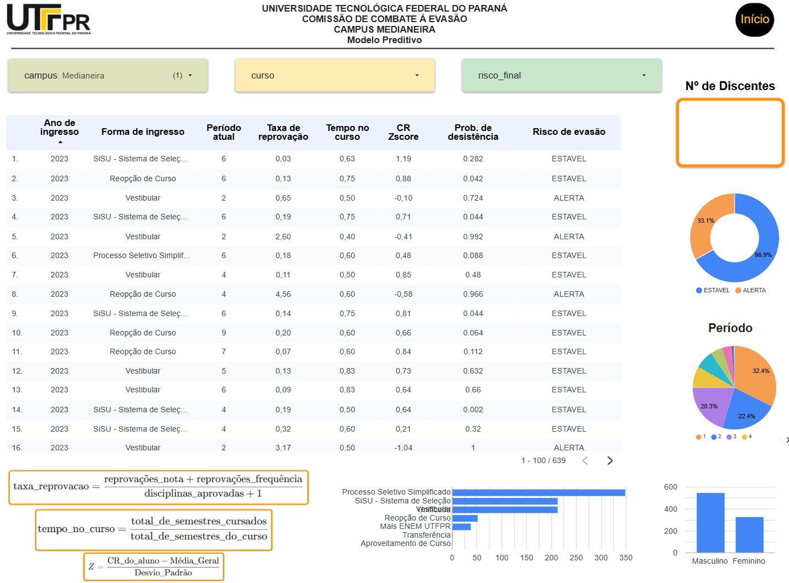
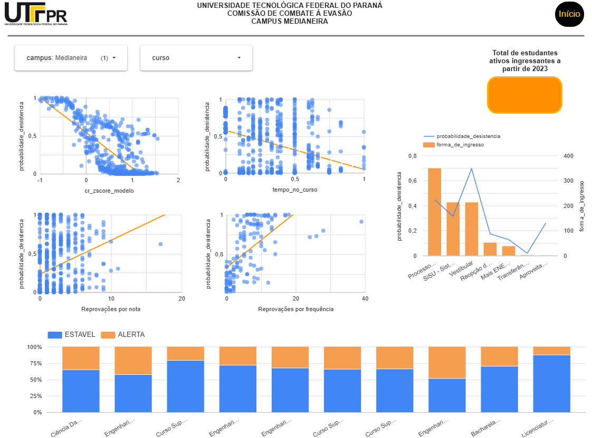
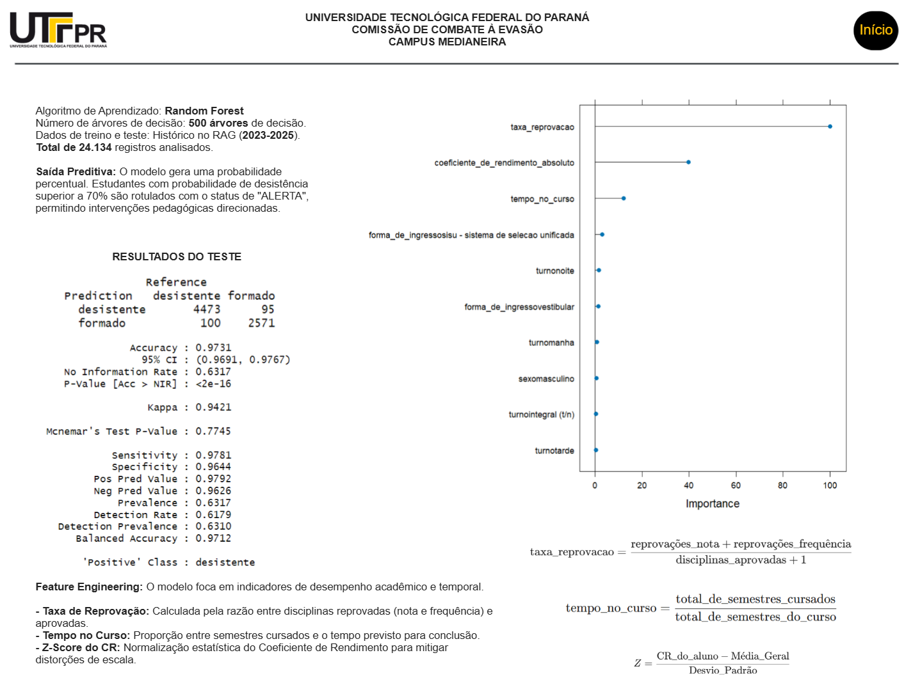

# 🏫 Predição de Evasão de Estudantes - UTFPR (2023-2025)

 &nbsp; &nbsp;</a>
 &nbsp; &nbsp;</a>
 &nbsp; &nbsp; </a>
 &nbsp; &nbsp; </a>

Este projeto apresenta o desenvolvimento de um modelo preditivo de Machine Learning para identificar o risco de evasão acadêmica nos *campi* da **Universidade Tecnológica Federal do Paraná (UTFPR)**. O modelo analisa dados históricos de estudantes desligados e graduados no período de 2023 a 2025 para prever o comportamento de alunos atualmente regulares.

A solução final integra um pipeline robusto em **R** com a visualização estratégica de indicadores em um painel interativo desenvolvido no **Looker Studio**.

---

## 📊 Estrutura do Painel de Tomada de Decisão (Looker Studio)

Para que as coordenações de curso e pró-reitorias possam agir preventivamente, os resultados gerados pelo modelo preditivo foram exportados e conectados ao **Looker Studio**. 

> 📌 *Nota de Confidencialidade: Em conformidade com a LGPD e regras institucionais, os microdados reais estão protegidos. Abaixo estão representadas as visões estruturais do painel gerado.*

<<<<<<< HEAD

* **Visão Geral do resultado da análise preditiva que gerou a probabilidade de evasão para os estudantes:**

  

* **Análise por Campus e Alunos em Situação de Alerta para evasão:**

=======
* **Visão Geral do resultado da análise preditiva que gerou a probabilidade de evasão para os estudantes:**
  

* **Análise por Campus e Alunos em Situação de Alerta para evasão:**
>>>>>>> 10a22a8a3dd455a5765037bb4ad92109e4bc1061
  
  

* **Informações sobre o modelo preditivo:**

<<<<<<< HEAD
=======
* **Análise por Campus e Alunos em Situação de Alerta para evasão:**
>>>>>>> 10a22a8a3dd455a5765037bb4ad92109e4bc1061
  

---

## 🛠️ Tecnologias e Pacotes Utilizados

O projeto foi inteiramente desenvolvido utilizando a linguagem **R** e o ecossistema **RStudio**. Os principais pacotes utilizados foram:

* **Manipulação e Limpeza:** `tidyverse` (`dplyr`, `ggplot2`, `forcats`), `janitor`, `stringi`
* **Modelagem e Pré-processamento:** `caret`, `randomForest`
* **Avaliação do Modelo:** `pROC`
* **Leitura e Escrita de Dados:** `readxl`, `openxlsx`

---

## 📈 Abordagem Metodológica e Pipeline de Dados

O script foi projetado com foco em **evitar Data Leakage (Vazamento de Dados)**, garantindo que as métricas de validação correspondam à performance real do modelo em dados nunca vistos.

### 1. Limpeza Ultra-Agressiva e Padronização
* Remoção de valores nulos estruturais (`na.omit`).
* Padronização de strings (remoção de acentos via ASCII e conversão para caixa baixa) para evitar que divergências de digitação quebrassem as variáveis categóricas de `sexo`, `turno`, `forma_de_ingresso` e `tipo_de_cota`.

### 2. Engenharia de Recursos (Feature Engineering)
Além das variáveis base da instituição, foram criadas duas métricas derivadas críticas para o comportamento de abandono:
* **Taxa de Reprovação:** Calculada pela fórmula 
    $$\text{Taxa de Reprovação} = \frac{\text{Reprovações Nota} + \text{Reprovações Frequência}}{\text{Disciplinas Aprovadas} + 1}$$
* **Tempo no Curso:** Proporção do tempo regulamentar já consumido pelo estudante.

### 3. Pré-Processamento e Proteção contra Viés
* **Normalização Estrita:** A centralização e escala (*Z-score*) das variáveis numéricas (como o Coeficiente de Rendimento Absoluto) foram calculadas **apenas na base de treino (70%)** e aplicadas posteriormente no teste e nos dados ativos.
* **Tratamento de Categorias Novas:** Implementação de um nível `"outros"` padrão utilizando `fct_other` para evitar que o modelo quebre ao encontrar uma forma de ingresso ou cota inédita nos dados dos alunos matriculados.
* **Desbalanceamento de Classes:** Aplicação de **Up-sampling** (`sampling = "up"`) na validação cruzada de 5 folds para mitigar a disparidade numérica entre o total de formados e desistentes.

---

## 📊 Resultados alcançados

A aplicação do modelo preditivo aos dados dos estudantes regulares (ativos) permitiu a identificação daqueles
com alto potencial para evasão, a partir do indicador gerado e chamado de Probabilidade de Evasão. Estudantes 
com Probabilidade de Evasão maior do que 70% foram classificados com o status de ALERTA para evasão.

Esta identificação permitiu que ações preventivas fossem planejadas, estruturadas e executadas antes da evasão 
se consolidar. 

De acordo com a análise de relevância gerada pelo comando varImp(modelo_evasao), os fatores com maior peso na
tomada de decisão do modelo foram:

1 - Coeficiente de Rendimento Absoluto (CR) (Normalizado via Z-Score);

2 - Taxa de Reprovação;

3 - Tempo no Curso.

---

## 🤖 O Modelo Preditivo

O algoritmo selecionado foi o **Random Forest (rf)**, treinado via pacote `caret` buscando a otimização da métrica **AUC-ROC**.

```R
# Estrutura do treinamento no Caret
ctrl <- trainControl(method = "cv", number = 5,
                     classProbs = TRUE,
                     summaryFunction = twoClassSummary,
                     sampling = "up")

modelo_evasao <- train(situacao_atual ~ sexo + coeficiente_de_rendimento_absoluto +
                       taxa_reprovacao + tempo_no_curso + forma_de_ingresso + 
                       tipo_de_cota + turno,
                       data = train_pp, method = "rf", 
                       trControl = ctrl, metric = "ROC")
                       
---

## 🤖 Uso de Inteligência Artificial Generativa

A lógica estrutural do script em R e as diretrizes de boas práticas de Machine Learning 
(como a separação estrita de dados de treino/teste e tratamentos de *data leakage*) foram desenvolvidas 
em colaboração com o **Google Gemini**. A ferramenta foi utilizada como um co-piloto técnico para validação 
de código, refinamento da engenharia de recursos (*feature engineering*) e suporte na estruturação e 
documentação do pipeline Git/GitHub deste repositório.
<<<<<<< HEAD

=======
>>>>>>> 10a22a8a3dd455a5765037bb4ad92109e4bc1061
